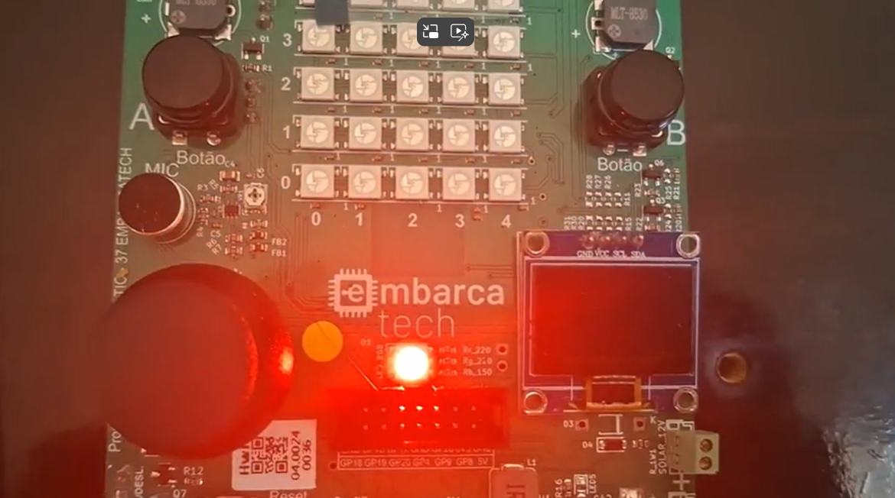

# EmbarcaTech_Unidade4_Clock_Temporizadores_1.

  

## Atividade: Temporizador Periódico e Controle de Semáforo na BitDogLab

## Descrição do Projeto

Este projeto tem como objetivo consolidar a compreensão dos conceitos relacionados ao uso de temporizadores periódicos no microcontrolador RP2040 e explorar as funcionalidades da placa de desenvolvimento BitDogLab. Para isso, foi implementado um semáforo utilizando a função add_repeating_timer_ms() presente na ferramenta Pico SDK.

O semáforo alterna entre as cores vermelho, amarelo e verde a cada 3 segundos, conforme definido no fluxograma da atividade. Além disso, uma mensagem é impressa na porta serial a cada segundo.

## Componentes Utilizados

- **Microcontrolador Raspberry Pi Pico W (RP2040)**: Responsável pelo controle dos pinos GPIO.
- **LED RGB**: Com os pinos conectados às GPIOs 11, 12 e 13.
- **03 Resistores de 330 Ω**: Para limitação de corrente nos LEDs.
- **LED RGB**: Utilizado para reproduzir o funcionamento do semáforo via GPIOs 11, 12 e 13 na placa BitDogLab.

## Ambiente de Desenvolvimento

- **VS Code**: Ambiente de desenvolvimento utilizado para escrever e debugar o código.
- **Linguagem C**: Linguagem de programação utilizada no desenvolvimento do projeto.
- **Pico SDK**: Kit de Desenvolvimento de Software utilizado para programar a placa Raspberry Pi Pico W.
- **Simulador Wokwi**: Ferramenta de simulação utilizada para testar o projeto.

## Guia de Instalação

1. Clone o repositório:
2. Importe o projeto utilizando a extensão da Raspberry Pi.
3. Compile o código utilizando a extensão da Raspberry Pi.
4. Caso queira executar na placa BitDogLab, insira o UF2 na placa em modo bootsel.
5. Para a simulação, basta executar pela extensão no ambiente integrado do VSCode.

## Guia de Uso

O semáforo inicia com o LED vermelho aceso.

A cada 3 segundos, a cor muda seguindo a ordem: vermelho → amarelo → verde → vermelho.

A cada 1 segundo, uma mensagem é impressa na porta serial.

O experimento também pode ser realizado utilizando o LED RGB nas GPIOs 11, 12 e 13 da BitDogLab.

## Testes

Testes básicos foram implementados para garantir que cada componente está funcionando corretamente. 

## Desenvolvedor

[Lucas Gabriel Ferreira](https://github.com/usuario-lider)

## Vídeo da Solução

Clique na imagem abaixo para assistir ao vídeo que demonstra a solução trabalhada e os resultados obtidos nos experimentos:

  

